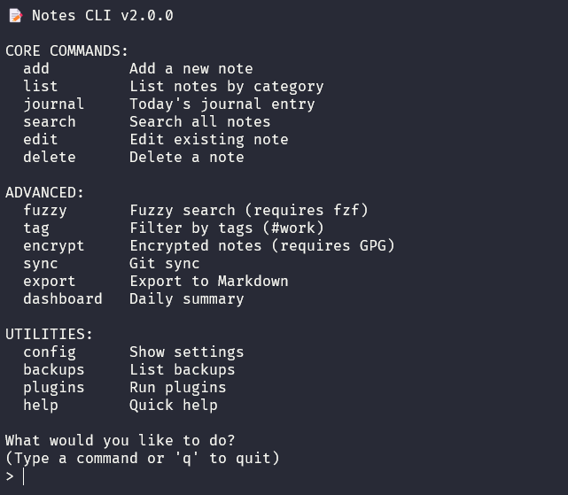

<p align="center">
  
</p>
# 📝 Notes CLI

A powerful, extensible terminal-based note-taking application designed for developers and command-line enthusiasts. With built-in encryption, backup, Git sync, and plugin support, Notes CLI keeps your ideas organized and secure—right from your terminal.

---

## ✨ Features

### 🧠 Core Functionality

* 🖊️ **Interactive Menu** — Launch with `notes` for a clean, guided interface
* 📓 **Note Management** — Add, edit, delete, and categorize notes effortlessly
* 🗓️ **Daily Journaling** — Auto-generates journal entries with timestamps
* 🔍 **Global Search** — Keyword, fuzzy (`fzf`), and tag-based filtering
* 📌 **Tag System** — Organize with `#hashtags`, filter with ease
* 📄 **Markdown Export** — Convert notes to Markdown for external use
* 💾 **Auto Backup** — Configurable backups with retention control
* 🔄 **Git Integration** — Enable Git-based version control and cloud sync

### 🔐 Security & Privacy

* 🔒 **GPG Encryption** — Secure sensitive notes with strong encryption
* 🛀 **Private Notes** — Encrypted files stored separately for peace of mind
* ⚖️ **Safe Filenames** — Automatically sanitizes file names to prevent issues

### 🔌 Plugin Support

Built-in and custom plugins for extra functionality:

* ☀️ **Weather**: Live weather reports via `wttr.in`
* ⏰ **Reminders**: Set and manage scheduled tasks
* 🔋 **System Info**: Battery, uptime, network, calendar, and stats
* 💾 **Backups**: On-demand backup control

### 🎨 Theming & Customization

* 🎨 Minimal, Solarized, Gruvbox, and Dracula themes
* ⚙️ Configurable editor, GPG identity, note categories, and more
* 🔧 Easily extend with your own shell-based plugins

---

## 🚀 Quick Start

### ✅ Prerequisites

* **Required**: `bash`, `grep`, `sed`, `date`, `mkdir`, `cp`, `rm`
* **Optional but recommended**:

  * [`fzf`](https://github.com/junegunn/fzf) — Fuzzy finder
  * `gpg` — For encrypted notes
  * `git` — For sync and version control

### 📦 Installation

#### Option 1: Automated Setup (Recommended)

```bash
git clone https://github.com/MarufHossain14/notes-cli.git
cd notes-cli
bash install.sh
```

#### Option 2: Manual Setup

```bash
git clone https://github.com/MarufHossain14/notes-cli.git
cd notes-cli
chmod +x notes.sh

# Create a symlink
mkdir -p ~/.local/bin
ln -sf "$PWD/notes.sh" ~/.local/bin/notes

# Add to PATH (if needed)
echo 'export PATH="$HOME/.local/bin:$PATH"' >> ~/.bashrc
source ~/.bashrc

# Copy default configuration
cp .notesrc ~/.notesrc
```

---

## 🔧 Initial Configuration

1. Restart terminal or `source ~/.bashrc`
2. Run `notes help` to test installation
3. Launch the app with `notes`
4. Configure via `notes config` or edit `~/.notesrc` directly
5. ✨ (Optional) Generate GPG key:

   ```bash
   gpg --full-generate-key
   ```
6. 🔄 (Optional) Set up Git sync:

   ```bash
   cd ~/notes
   git init
   git remote add origin <your-repo-url>
   ```

---

## 🛠️ Usage Overview

### 🔍 Interactive Mode (Recommended)

```bash
notes
```

A menu-driven interface where you can:

* `add` — Add a new note
* `journal` — Write today's journal
* `list` — View notes by category
* `search` — Search notes
* `dashboard` — Daily summary
* `q` — Quit the app

### 🔢 Command Shortcuts

```bash
notes add        # Add a new note
notes list       # List notes
notes journal    # Journal entry
notes search     # Keyword search
notes fuzzy      # Fuzzy finder
notes encrypt    # Encrypted note
notes decrypt    # Decrypt note
notes sync       # Git sync
notes export     # Export to Markdown
notes backups    # View backups
notes config     # Show config
```

---

## 🔖 Examples

### 📂 Add a Note

```bash
notes add
```

### 🔍 Search Notes

```bash
notes search meeting
notes tag #project
notes fuzzy
```

### 🔒 Secure a Note

```bash
notes encrypt
```

---

## ⚙️ Configuration File: `~/.notesrc`

```bash
THEME="gruvbox"
EDITOR="nano"
NOTES_DIR="$HOME/notes"
GPG_USER="your-email@example.com"
AUTO_SYNC=false
BACKUP_RETENTION_DAYS=7
DEFAULT_CATEGORIES=("Work" "Personal" "Journal" "Ideas" "Tasks")
```

---

## 🔌 Plugins

### ▶️ Run Built-in Plugins

```bash
notes plugins      # All plugins
notes weather      # Weather info
notes reminder     # Reminders
notes stats        # Statistics
```

### 💭 Add Your Own Plugin

Add a `.sh` file in `~/.notes_plugins/`:

```bash
#!/usr/bin/env bash
echo "📋 Hello from my plugin!"
```

---

## 🗂️ File Structure

```
~/notes/
├── work.txt
├── personal.txt
├── journal-YYYY-MM-DD.txt
├── private/           # Encrypted notes
├── backups/           # Backup copies
~/.notesrc             # Config file
~/.local/bin/notes     # Executable
```

---

## 🧰 Troubleshooting

| Issue                   | Fix                                                                 |
| ----------------------- | ------------------------------------------------------------------- |
| `command not found`     | Ensure `~/.local/bin` is in your `$PATH`                            |
| `fzf not found`         | Install: `sudo apt install fzf` or `brew install fzf`               |
| `GPG encryption failed` | Run: `gpg --full-generate-key` and check `GPG_USER` in `~/.notesrc` |
| `Git sync not working`  | Run `git init` and add a remote in your notes folder                |

---

## 🤝 Contributing

We welcome contributions!

1. Fork the repository
2. Create a feature branch
3. Write and test your changes
4. Submit a pull request

---

## 📄 License

This project is licensed under the [MIT License](LICENSE).

---

## 🙏 Acknowledgments

* Built with Bash
* Fuzzy search via [`fzf`](https://github.com/junegunn/fzf)
* Weather data from [wttr.in](https://wttr.in)
* Inspired by minimal, powerful CLI tooling
* Thanks to contributors and users for feedback!
